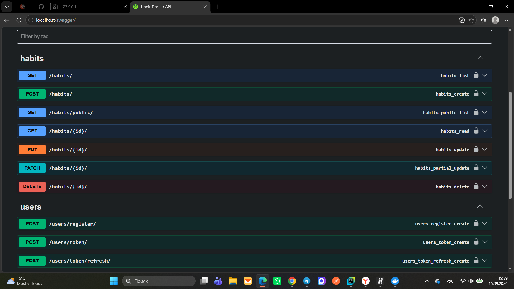
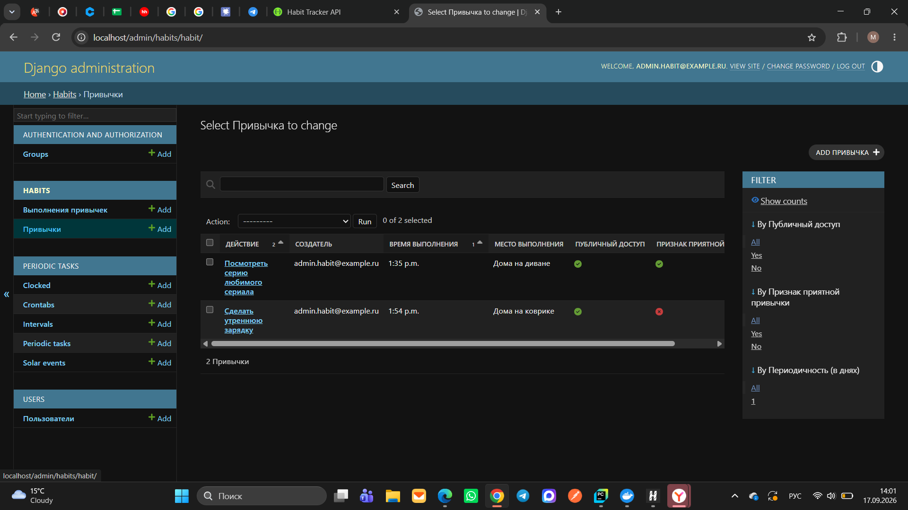
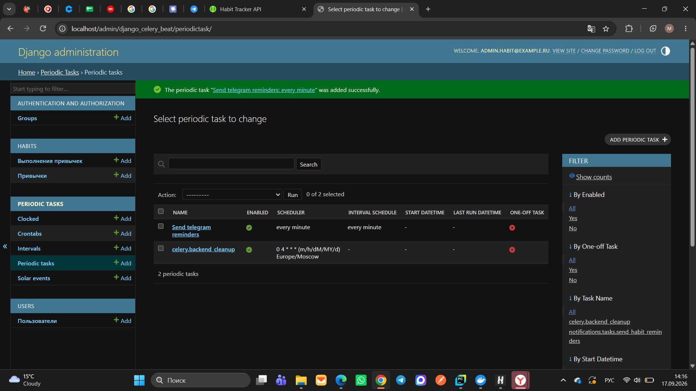
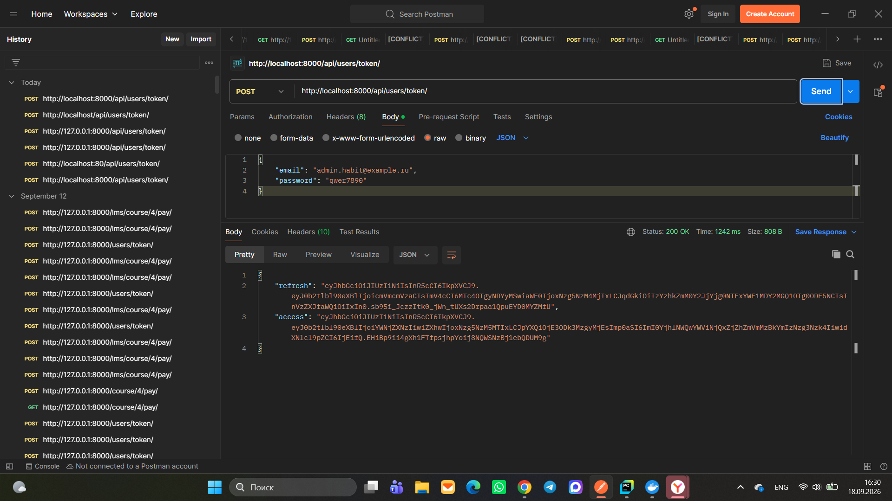
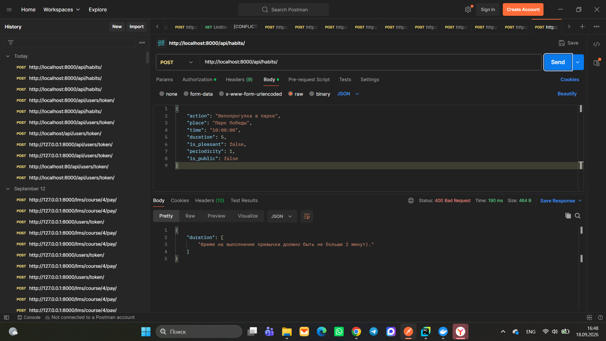
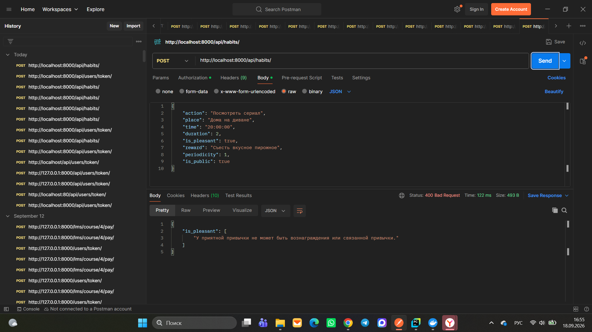
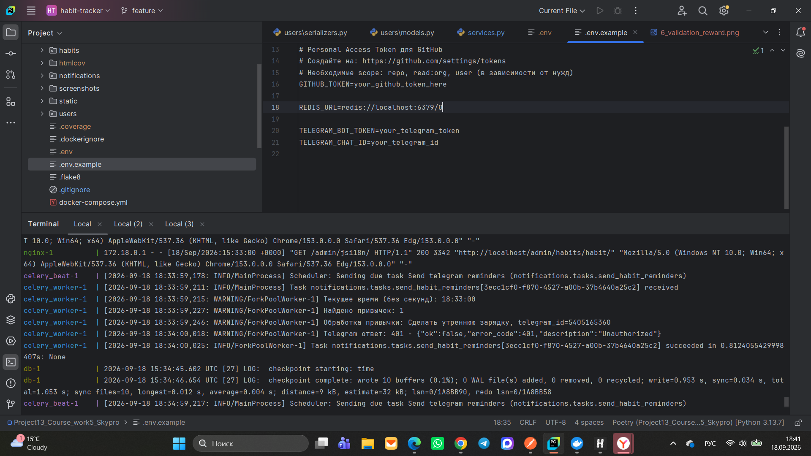

# 🚀 Habit Tracker API (Трекер полезных привычек)

[](https://github.com/Margarita2405/habit-tracker/actions)

Бэкенд-сервис для создания и отслеживания полезных привычек, помогающий пользователям формировать здоровый образ жизни.
Проект реализует REST API со строгой бизнес-валидацией привычек, JWT-авторизацией, асинхронными очередями Celery и 
автоматической отправкой напоминаний в Telegram.

---

## 📌 Содержание

- 🧩 [Описание и бизнес-логика](#описание-и-бизнес-логика)
- 🛠 [Технологии](#технологии)
- 🏁 [Локальный запуск](#локальный-запуск)
  - [С использованием Docker](#с-использованием-docker)
  - [Без Docker (ручной запуск)](#без-docker-ручной-запуск)
- 🔐 [Переменные окружения](#переменные-окружения-env)
- 📚 [API Эндпоинты](#api-эндпоинты)
- 🧪 [Тестирование и валидация](#тестирование-и-валидация)
- 📊 [Демонстрация работы проекта](#демонстрация-работы-проекта)
- 📁 [Статические и медиа-файлы](#статические-и-медиа-файлы)
- 👩‍💻 [Автор](#автор)

---

## 🧩 Описание и бизнес-логика

Проект автоматизирует работу с привычками согласно методологии их формирования, накладывая строгие ограничения на сущности:
- **Разделение привычек:** Привычки делятся на *полезные* (основные) и *приятные* (которые выступают в роли вознаграждения).
- **Связанные привычки:** Полезную привычку можно связать с приятной в качестве награды за выполнение (например: «побегать 30 минут», а затем «посмотреть серию сериала»).
- **Изоляция и публичность:** Пользователи управляют строго своими приватными привычками, но могут просматривать общий список публичных привычек других участников для вдохновения.
- **Интеграция с Telegram:** Подключен фоновый планировщик, который автоматически отправляет пользователю напоминание в мессенджер, когда наступает время выполнять привычку.

---

## 🛠 Технологии

- **Python 3.13** + **Poetry**
- **Django 6.0** + **Django REST Framework (DRF)**
- **PostgreSQL** (Основная СУБД)
- **Celery** + **Redis** (Менеджер задач, брокер очередей и кэш)
- **django-celery-beat** (Динамический планировщик напоминаний)
- **Telegram Bot API** + **Requests** (Интеграция с мессенджером)
- **drf-yasg** (Интерактивная документация Swagger/ReDoc)
- **Docker** + **Docker Compose**

---

## 🏁 Локальный запуск

### С использованием Docker (рекомендуется)

1. **Клонируйте репозиторий и перейдите в папку проекта:**
```bash
git clone https://github.com/Margarita2405/habit-tracker
cd habit-tracker
```

2. **Подготовьте переменные окружения:**
```bash
cp .env.example .env
```
*Заполните обязательные параметры: секретный ключ Django, доступы к БД и токен вашего Telegram-бота.*

3. **Запустите контейнеры инфраструктуры:**
```bash
docker-compose up --build
```
*Docker автоматически соберёт бэкенд и развернёт изолированные контейнеры для Django, PostgreSQL и Redis.*

4. **Выполните миграции и создайте администратора сайта:**
```bash
docker-compose exec web python manage.py migrate
docker-compose exec web python manage.py createsuperuser
```

### Без Docker (ручной запуск)

1. **Войдите в виртуальное окружение и установите пакеты через Poetry:**
```bash
poetry shell
poetry install
```
2. **Убедитесь, что у вас запущены локальные сервисы PostgreSQL и Redis.**
3. **Запустите миграции, Celery-воркер и веб-сервер:**
```bash
python manage.py migrate
python manage.py runserver
```

---

## 🔐 Переменные окружения (.env)

Заполните файл `.env` в корневом каталоге приложения следующими параметрами:

```text
SECRET_KEY=your_django_secret_key
DEBUG=True
ALLOWED_HOSTS=localhost,127.0.0.1

# Конфигурация PostgreSQL
DATABASE_NAME=habit_tracker
DATABASE_USER=postgres
DATABASE_PASSWORD=your_secure_password
DATABASE_HOST=db
DATABASE_PORT=5432

# Конфигурация брокера задач Redis
REDIS_URL=redis://redis:6379/0

# Интеграция с Telegram
TELEGRAM_BOT_TOKEN=your_telegram_bot_token
TELEGRAM_CHAT_ID=your_telegram_chat_id
```

---

## 📚 API Эндпоинты

### Основной модуль привычек (`/api/habits/`)

| Метод | URL | Описание |
| :--- | :--- | :--- |
| **GET** | `/api/habits/` | Список личных привычек текущего пользователя (с пагинацией по 5 элементов) |
| **POST** | `/api/habits/` | Создание новой привычки (включает автоматическую бизнес-валидацию) |
| **GET** | `/api/habits/{id}/` | Детальная информация по конкретной привычке |
| **PUT/PATCH** | `/api/habits/{id}/` | Редактирование параметров привычки её непосредственным владельцем |
| **DELETE** | `/api/habits/{id}/` | Полное удаление привычки из системы |
| **GET** | `/api/habits/public/` | Общий список всех публичных привычек (доступен всем авторизованным пользователям) |

### Авторизация и пользователи

| Метод | URL | Описание |
| :--- | :--- | :--- |
| **POST** | `/api/users/register/` | Создание нового аккаунта пользователя на платформе |
| **POST** | `/api/users/token/` | Получение пары JWT-токенов (`access` и `refresh`) |
| **POST** | `/api/users/token/refresh/` | Обновление просроченного `access`-токена |

---

## 🧪 Тестирование и валидация

В проекте реализована **жесткая кастомная валидация** на уровне моделей и сериализаторов, полностью исключающая некорректные бизнес-сценарии:
1. Исключено одновременное указание связанной привычки и текстового вознаграждения.
2. Время выполнения одной привычки жестко ограничено (не более 120 секунд / 2 минут).
3. В качестве связанных привычек система пропускает строго те, у которых установлен признак `is_pleasant=True` (приятная привычка).
4. У приятной привычки запрещено наличие вознаграждения или связанной привычки.
5. Периодичность выполнения не может быть реже, чем 1 раз в 7 дней.

**Запуск юнит-тестов для проверки покрытия логики и валидаторов:**
```bash
docker-compose exec web python manage.py test
```

**Запуск с отчетом о покрытии кода (Coverage):**
```bash
coverage run manage.py test
coverage report -m
```

---

## 📊 Демонстрация работы проекта

### 1. Документация API (Swagger UI)
Интерактивное отображение всех эндпоинтов управления трекером привычек, публичных списков и авторизации.


### 2. Панель администратора (Django Admin)
Централизованный интерфейс администрирования сущностей, ведения каталога привычек и визуального контроля их признаков.


### 3. Менеджер периодических задач (Celery Beat)
Настроенный планировщик задач, который каждую минуту инициирует проверку расписания и запускает фоновые процессы.


### 4. Авторизация по протоколу JWT (Postman)
Процесс генерации токенов доступа (`access`/`refresh`) для безопасного взаимодействия клиента с закрытыми эндпоинтами бэкенда.


### 5. Бизнес-валидация данных в действии (Ограничение времени)
Пример работы кастомного валидатора: при попытке выставить длительность привычки более 2 минут API блокирует запрос и возвращает понятную ошибку `400 Bad Request`.


### 6. Бизнес-валидация данных в действии (Конфликт наград)
Пример защиты данных: попытка одновременно указать и текстовое вознаграждение, и связанную приятную привычку блокируется валидатором.


### 7. Мониторинг фоновых воркеров Celery Worker
Успешный лог выполнения асинхронной задачи рассылки уведомлений `send_habit_reminders` в режиме реального времени.


---

## 📁 Статические и медиа-файлы

- Статические файлы (конфигурации CSS, JS для админки) собираются автоматически в директорию `static/`.
- Пользовательский медиа-контент сохраняется в изолированном каталоге `media/`.

---

## 👩‍💻 Автор

**Маргарита Буршева**
- **Email:** mbursheva@mail.ru
- **GitHub Проект:** [habit-tracker](https://github.com)

*Курсовой проект выполнен в рамках программы обучения Университета Skypro.*
